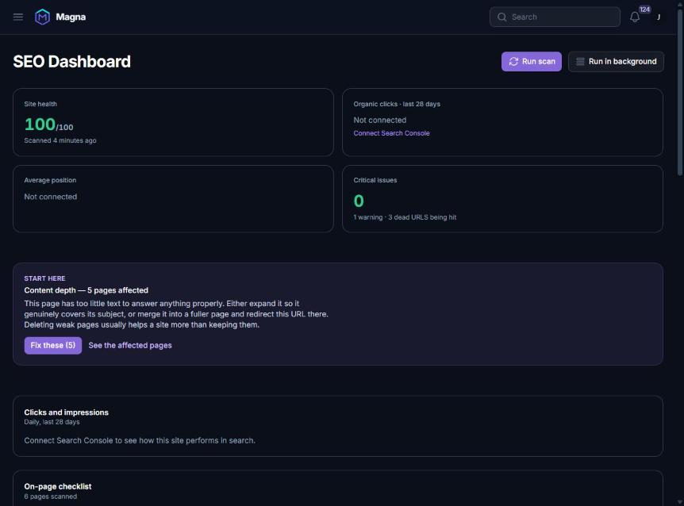
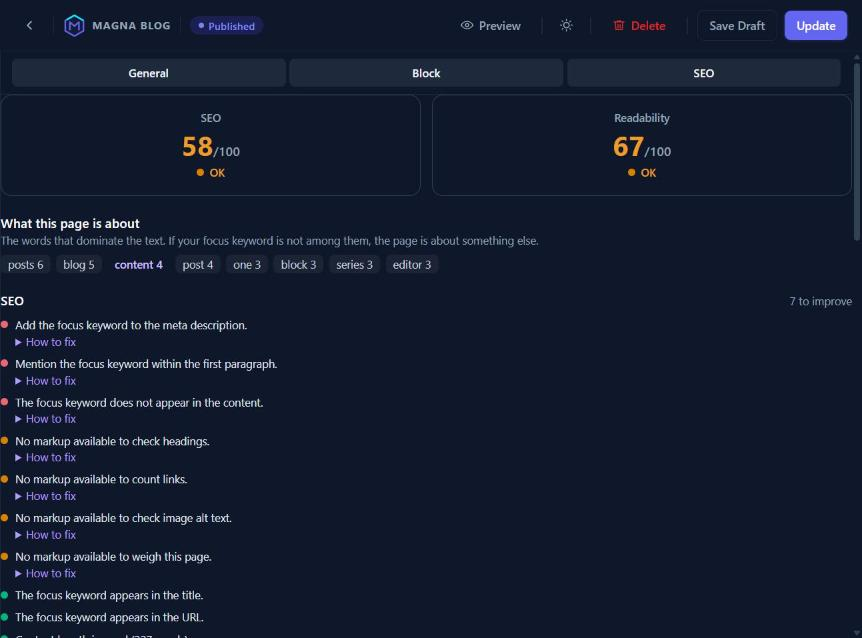
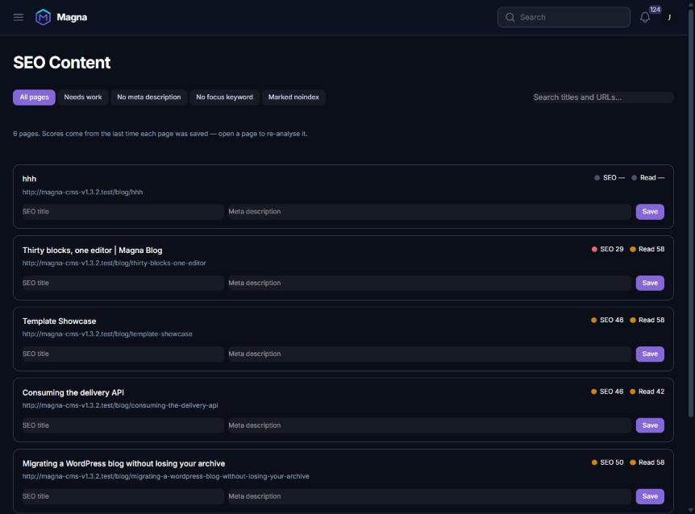
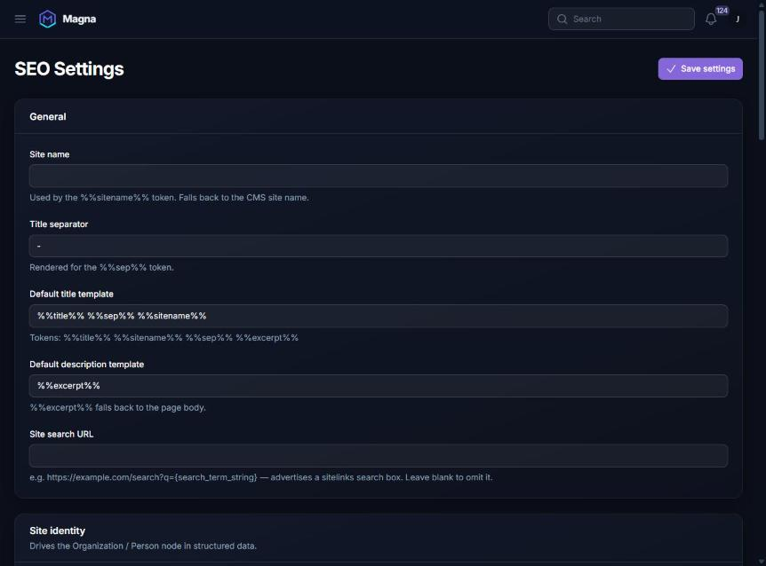

<p align="center">
  
</p>

<h1 align="center">Magna SEO</h1>

<p align="center">
  One SEO layer for every surface a <strong>Magna CMS</strong> site exposes.
</p>

<p align="center">
  <a href="LICENSE"></a>
  <a href="composer.json"></a>
  <a href="https://github.com/Magna-CMS"></a>
  
</p>

Server-rendered HTML, the delivery JSON API and XML sitemaps are all driven from a
single per-subject meta store through a single resolver, so the same content can
never emit conflicting or duplicate metadata on two surfaces.

The plugin is **capability-detected**: it hard-depends on no other plugin, and no
plugin is required to depend on it. A content plugin describes its content to SEO
by registering one class; meta, structured data, sitemaps, scans and scores all
follow from that.

---

## Screenshots

### The dashboard

Site health, Search Console figures, the single highest-value thing to fix, and
every page that needs work — worst first, each one a link.



### Live analysis while you write

Two scores that move as you type, the words the page is actually about, and every
check with its fix written beside it. Below these sits a pixel-accurate preview of
the Google result — measured in pixels, because Google truncates by width, not by
character count. The same PHP analyser runs here and in the scan, so the editor can
never disagree with the report.



### Every page and its SEO state

Titles and meta descriptions editable in place — because nobody fixes two hundred
missing descriptions by opening two hundred editors.



### Settings

Site identity, templates per content type, AI crawler policy, Search Console and
IndexNow — all in one place.



---

## What it does

**Meta, everywhere, once.** Title and description templates with tokens
(`%%title%%`, `%%sitename%%`, `%%sep%%`, `%%excerpt%%`, `%%category%%`, `%%date%%`,
`%%locale%%`, plus tokens a source registers itself), per-content-type defaults and
per-entity overrides. The resolved result renders into `<head>`, into the delivery
API payload, and into sitemaps from the same call.

**Indexability you can trust.** Drafts, scheduled content, maintenance mode, the
not-found page, non-production environments and preview-token requests are all
`noindex` by construction, not by remembering to tick a box.

**Social cards.** Open Graph and Twitter, with `og:image:width` and
`og:image:height` read from the media library — the single most common reason a
card renders wrong in the wild. Fallback chain: entity override, featured image,
first content image, site default.

**Structured data.** One `@graph` with `@id` linking, not five disconnected
islands: `WebSite` (with `SearchAction`), `Organization` or `Person`, `WebPage`,
`Article` / `BlogPosting` / `TechArticle` by subject type, `BreadcrumbList`,
`ImageObject`, and `FAQPage` / `HowTo` when a source supplies them. Validated
locally against schema.org shapes — no network call on render.

**Sitemaps, robots and hreflang.** A sitemap index with per-source children,
paginated at 5 000 URLs, `lastmod` from real content change, image entries, gzip
and tagged-cache purge. `robots.txt` generated with a static-file conflict check.
Reciprocal hreflang across translations.

**Redirects and 404s.** Exact, prefix and regex matching with 301/302/307/308,
query preservation, loop and chain detection, and a logged 404 list you can turn
into a redirect in one click. Runs as global middleware, so a URL with no route at
all is still caught.

**On-page analysis.** Checks across SEO and readability, scored separately, with
the fix written next to each failure. Scores are stored, so the content list, the
entry-table badges and the "needs work" filter all mean something — and a page
with no body text is left unscored rather than given a number assembled from
checks that cannot fail on emptiness.

**Site scan.** A static, no-HTTP scan over every indexable subject: missing titles
and descriptions, duplicates, thin content, orphan pages, missing alt text, heavy
pages, invalid schema, canonical conflicts, hreflang reciprocity, redirect chains
and robots/sitemap conflicts. Findings group by page, and each one links to where
it can be cleared across the whole site.

**Search engines.** Search Console (cached, never blocking a render), IndexNow
with batched submission, and Bing Webmaster. Credentials are stored encrypted.

**AI platforms.** `llms.txt` and `llms-full.txt`, plus per-crawler policy for
`GPTBot`, `ClaudeBot`, `PerplexityBot`, `Google-Extended`, `Applebot-Extended` and
the rest — separating *crawl for answers* from *crawl for training*, which are the
two decisions site owners actually want to make differently.

---

## How it fits together

```
Content plugin ──registers──► SeoSourceRegistry
      │                              │
      ▼                              ▼
 SeoSubjectSource ──produces──► SeoSubject (value object)
                                     │
                                     ▼
                               MetaResolver ──► HeadPayload ──┬─► HeadHtmlRenderer     (rendered <head>)
      per-entity overrides ────────┘                          ├─► DeliverySeoDecorator (delivery `seo` JSON)
      (magna_seo_meta)                                        └─► SchemaGraphBuilder    (JSON-LD @graph)
                                                  │
                                                  ▼
                                   SitemapGenerator · SiteScanner · ContentAnalyser
```

One `SeoSubject` in, identical meta out on every surface.

---

## Requirements

| | |
|---|---|
| PHP | `^8.3` |
| Magna CMS | `^1.0` |
| Database | Anything Laravel supports |

## Install

### You Can directly install SEO Plugin from Magna Plugin Marketplace or

```bash
composer require magna-cms/seo
```

```bash
php artisan magna:plugin:enable magna-cms/seo
```

Plugin migrations are not picked up by a bare `php artisan migrate` — point it at
the plugin:

```bash
php artisan migrate --path=vendor/magna-cms/seo/database/migrations
```

Then open **SEO → Setup** in the admin panel. It is a checklist, not a wizard:
every step reports whether it is already done, so an install halfway through a
migration shows what is left rather than walking you through decisions you have
already made.

## Commands

| Command | What it does |
|---|---|
| `seo:scan` | Run the static site scan. `--queue` dispatches it instead |
| `seo:analyse <source> <id>` | Score one page and print its checks |
| `seo:analyse --all` | Score every page and store the results |
| `seo:scorecard` | Verify the site is SEO-correct by construction |
| `seo:robots` | Print the generated `robots.txt` |
| `seo:redirects` | Import, export and audit redirects |
| `seo:indexnow` | Flush the IndexNow submission queue |
| `seo:bing` | Submit URLs to Bing Webmaster |
| `seo:import` | Import meta from another SEO plugin |

## Permissions

`seo.meta.edit` · `seo.settings.manage` · `seo.redirects.manage` ·
`seo.scans.run` · `seo.integrations.manage`

## Public routes

`/robots.txt` · `/sitemap.xml` · `/sitemap-{source}.xml` · `/llms.txt` ·
`/llms-full.txt` · site-verification files

---

## Integrating a content plugin

One class, and zero edits to this plugin:

```php
use Magna\Seo\Contracts\SeoSubjectSource;
use Magna\Seo\Subjects\SeoSubject;

final class ArticleSeoSource implements SeoSubjectSource
{
    public function handle(): string { return 'articles'; }

    public function label(): string { return 'Articles'; }

    public function modelClass(): ?string { return Article::class; }

    public function resolve(string $id): ?SeoSubject { /* … */ }

    public function chunk(callable $callback, int $size = 500): void { /* … */ }
}
```

Register it from your plugin's `boot()`, guarded so your plugin still runs with
SEO absent:

```php
if (class_exists(SeoSourceRegistry::class)) {
    $this->app->afterResolving(
        SeoSourceRegistry::class,
        static function (SeoSourceRegistry $registry): void {
            if (! $registry->has('articles')) {
                $registry->register(new ArticleSeoSource);
            }
        },
    );
}
```

Set `modelId` on every subject you build. Per-entity overrides and cached scores
are keyed by model class **and** id, so a subject without it silently loses its
saved title, description, focus keyword and scores.

Full detail in [`docs/integration.md`](docs/integration.md).

## Documentation

| | |
|---|---|
| [`docs/integration.md`](docs/integration.md) | Registering a content source |
| [`docs/admin.md`](docs/admin.md) | The admin screens |
| [`docs/headless.md`](docs/headless.md) | SEO in the delivery API |
| [`docs/schema.md`](docs/schema.md) | Structured data and the `@graph` |
| [`docs/tokens.md`](docs/tokens.md) | Template tokens, and registering your own |
| [`docs/ai-platforms.md`](docs/ai-platforms.md) | `llms.txt` and AI crawler policy |

---

## Remaining work

Honest status. Phase 1 is complete and the plugin is in use; what follows is what
is *not* done.

### Not yet verified against the real services

- [ ] Google Rich Results Test against a live page, post and doc
- [ ] Facebook and X card debuggers against live URLs
- [ ] A full Search Console round trip on a verified property

### Known gaps

- [ ] **No HTTP crawler.** The scan is static — it reads the database, never the
      live site. Broken external links, real response codes, mixed content and
      redirect chains *as actually served* are therefore invisible to it.
- [ ] **No internal-linking graph.** Orphan detection exists as a scan check, but
      there are no inbound-link counts, no suggested parents and no equity view.
- [ ] **Core Web Vitals** are not collected. No PSI or CrUX field data.
- [ ] **Integration with `magna-cms/pages` is untested** against the real plugin;
      URL resolution currently runs through a config-driven resolver.

### Roadmap

Planned for a separate `magna-cms/seo-pro`, once 1.0 has been stable in the field:

- [ ] Opt-in, rate-limited, SSRF-guarded HTTP crawler
- [ ] Internal link graph with equity view and suggested parents
- [ ] AI suite — bring-your-own-key, every generation a suggestion a human
      accepts, fully functional with AI switched off
- [ ] Template-driven Open Graph image generation
- [ ] `Product`, `Recipe`, `Event`, `JobPosting`, `Course` and local-business
      schema
- [ ] Title and description A/B testing driven by Search Console CTR

Rank tracking is deliberately excluded: it needs paid SERP data.

---

## Testing

```bash
php artisan test
```

687 tests, 2 242 assertions. PHPStan level 8 and Pint, both clean.

## Licence

MIT. See [LICENSE](LICENSE).
